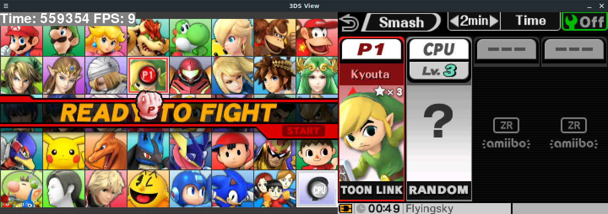

# Polari3DS
*Noob/Advanced-proof (N)3DS "Custom Firmware"*
*READ BELOW!!!!*
# 

twl redirection to sd patch:
https://github.com/Alexyo21/twl_firm_patcher

Rosalina with streams capabilities here addon for my fork:
https://github.com/Alexyo21/Streaming-Rosalina

Here is the nightly builds:
https://nightly.link/Alexyo21/Polari3DS/workflows/build/master/Polari3DS-nightly.zip

discord server in case of needing:
https://discord.com/invite/qR2D3dq43b

for a translated fork in italian, here you go (thanks to Simo):

(per una fork tradotta in italiano, ecco il link (grazie a Simo):
https://github.com/Simo3ds/CustomLuma3DS-ITA

This version comes bundled with pirate-laucher, twlpatches, rosalina streaming module aside only for new3ds...

https://github.com/cooolgamer/the-pirate-launcher

#

## next update

* nighshift remake;
* fix quick debugger in loader (missing process and data...)
 
(little feature)/(improvements):
* add cool patch like mcu bricker for notification led;

Revision

* fix and reformat chainloader
  
NOT AT THE MOMENT
* gateway sysnand support🤔 (gateway3ds can still cause many problems so for now i'm not adding it)

#

twl patch redirection aside
there are two  standalone version one stable with more feature, including the one to sd card, and one for now that has one feature which the redirection to sd this only,choose the you want, these can be used alone or alongside the with the emunand patch itself, for theoretically not use the nand at all, if you want to help join the group or if you need support with some error). thanks for the attention 

PS. if you have broken nand you need to use it with ntrboot, and put the officials firms files on sd, /luma folder, and have an emunand, obviously with boot.firm on the sd root.
(not tested yet)
#

the release build are not synced with the latest commit so if you want to see the latest changes you know how to do it also I only make new tag but destroy old released version i know I know but it'll keep less chaotic this repo, I you need an old release you can always grab old nightly...

## What is this fork
for debug build please remember to change also the sysmodule rsf to true forcedebug and false disable debug.
also set "build_gdb" to 1 and "no_nandcopy" to 1 so the boot firm won't be transfered to the nand ctr and put the release option in arm9 makefile to 0 and compile with "make all", not "release".
if you choose to download the one in release section, remember to put the noupdate.txt in luma folder.
Many of you probably know the NTR CFW that enabled streaming the 3DS' screen to the computer over the debugger.  
This fork implements this functionality into rosalina.  
It's still higly WIP and not intended for public use since framerates are quite slow.  
But it's more stable than the NTR firmware. You can switch games and the games I tested worked flawlessly.  
Some of the code is inspired by NTR but most of it is a complete reimplementation, because I wanted to figure out where the annoying bugs with the NTR firmware are. (e.g. 3DS hanging when switching processes)

### What's in here also  different from official luma3DS?

Restored UNITINFO and enable rosalina on safe_firm and disable arm11exceptions  and alos cut down wifi options on the luma config menu
- Added shortcuts:
  - Press start + select to toggle bottom screen (nice when you watch videos) inspired by [This](https://github.com/DullPointer/Luma3DS/commit/9fea831656446cbaa2b5b4f6364407bb1b35dee7), limit on o2ds, cause hardware register for up and down lcd are the same looking for new test though... also you can toggle even up display you have to change scrren brightness and with button Y you can change which screen you wanna toggle, it only works in there.
  - Press A + B + X + Y + Start to instantly reboot the console. Useful in case of freeze, but don't complain if your sdcard get corrupted because of this. also this needs to be activated in the hidden conf.(lumae.ini) also enabling ignore err disp will make your console ignore some hardware error be careful your hardware is still damaged... also for new3ds you should enable the rosalina susmodule(maybe not so sus...) in safe firm in hidden conf menu.
  - Press Start on Rosalina menu to toggle wifi -> [Original](https://github.com/DullPointer/Luma3DS/commit/c1a20558bed3d792d54069719a898006af20ba85)
  - Press Select on Rosalina menu to toggle LEDs -> [Original](https://github.com/DullPointer/Luma3DS/commit/fa70d374c00e39dee8b9ef54f60deb1da35a0c51) (and press Y to force blue led as a workaround when the battery is low)
- Added n3ds clock + L2 status in rosalina menu -> [Original](https://github.com/DullPointer/Luma3DS/commit/2dbfa8b5c9b719b7f3056691f54332f42da6de8d)
also selectable per title
- Added Software Volume Control -> [Original](https://github.com/DullPointer/Luma3DS/commit/dc636d82492d1e87eb51785fa7f2a98617e7ece9)
now updated through codec thanks to Pablomk7 and profi200
- Added extended brightness presets -> [Original](https://github.com/DullPointer/Luma3DS/commit/83e8d471a377bc6960fae00d6694f5fe86dcca42)
- Separated brightness for both screen
- Opening Rosalina menu with the home button (you can disable it on the extra config menu if you don't use it), in case you have some buttons broken
- Emulated home button press on Rosalina in case the home button is broken
- Added permanent brightness calibration by Nutez -> [Original](https://github.com/DullPointer/Luma3DS/commit/0e67a667077f601680f74ddc10ef88a799a5a7ad)
- Changed colors on config menu because why not
- Continue running after a errdisp error happens (you can press the instant reboot combo to reboot if nothing works needs to be activated in adavnced menu config.
- New3ds title configurator so you can choose which game to enable New 3DS performances on
- Extra config menu changeable from godmode9 if you need to deactivate a feature.
- Twl patch for emunand(not tested though🤔)
- Set play coins to 300 from rosalina thanks to gruetzig
- Disable update feature by creating a /luma/noupdate.txt file with at least one byte.
- cid and otp(mainly for antiban) custom loading (/luma/otp.bin and /luma/nand_cid.bin), option to use another nand backup and for using only emunand without sysnand (option hidden inside config.ini)(partially broken using another backup, useful for bit flipped otp or corrupted cid)
- Standby light turning off if enabled
- Boot modern homebrews on old versions, also cfw version spoofing(though you have to recompile it).
- powermenu options thanks to dullpointer
- Added the ability to redirect layeredFS path -> [Original](https://github.com/DeathChaos25/Luma3DS/commit/8f68d0a19d2ed80fb41bbe8499cb2b7b027e8a8c)
- Changed rosalina combo: default is L+Up (Dpad) in debug version, and L+Down+Select for release. You can change it in the Rosalina menu. (less buttons have to be pressed, useful for broken buttons)
- Added loading of custom logo while launching a app from luma/logo.bin
- Rehid folder disable option 
- Added debug capabilities like Seledreams fork, thanks to you.
- Also added streaming in it just cause why not, thanks to Byebyesky.
- Autoboot in dsi mode will boot directly twilightmenu++

## Usage of the streaming capability

1. Go to the rosalina menu->streaming->start streaming
2. Type the IP of your 3DS into the python script
3. Install the dependencies with `pip3 install pygame pillow numpy`
4. Start the script with `python3 streaming.py 4`
- should even work with ntrview for wiiu:

https://github.com/yawut/ntrview-wiiu

or snickerstream on pc:

https://github.com/RattletraPM/Snickerstream/releases

(Click the image for a video demo)

---

### What it is
**Luma3DS** is a program to patch the system software of (New) Nintendo (2)3DS handheld consoles "on the fly", adding features such as per-game language settings, debugging capabilities for developers, and removing restrictions enforced by Nintendo such as the region lock.

It also allows you to run unauthorized ("homebrew") content by removing signature checks.
To use it, you will need a console capable of running homebrew software on the Arm9 processor.

Since v8.0, Luma3DS has its own in-game menu, triggerable by <kbd>L+Up</kbd> for debug build and <kbd>L+Down+Select</kbd> for release build(see the [release notes](https://github.com/LumaTeam/Luma3DS/releases/tag/v8.0)).

#
### Compiling
* Prerequisites
    1. git
    2. [makerom](https://github.com/jakcron/Project_CTR) in PATH
    3. [firmtool](https://github.com/TuxSH/firmtool)
    4. Up-to-date devkitARM+libctru
1. Clone the repository with `git clone https://github.com/LumaTeam/Luma3DS.git`
2. Run `make`.
3. or grab the artifact on build ci(nightly). (thanks to minionguyjpro)

    The produced `boot.firm` is meant to be copied to the root of your SD card for usage with Boot9Strap/fastboot3ds/godmode9. or if you're brave firm0...

# 
 #### Docker Image 
 There is also a Docker image for compilation. Make sure you have Docker installed, and then run ``docker run -it pablomk7/luma3dsbuildtools`` in your terminal to get into a Docker container containing all the tools needed.

#
### Setup / Usage / Features
See https://github.com/LumaTeam/Luma3DS/wiki

https://gbatemp.net/threads/remake-unofficial-luma3ds.637949/
#
### Credits
See https://github.com/LumaTeam/Luma3DS/wiki/Credits
also added inside the cfw itself (thinking i have to add someone else, though don't remember the name 😅)

#
### Licensing
This software is licensed under the terms of the GPLv3. You can find a copy of the license in the LICENSE.txt file.

Files in the GDB stub are instead triple-licensed as MIT or "GPLv2 or any later version", in which case it's specified in the file header.
Also consider the copyright updated to 2023 in all files obviously it will retain the og authors, i will manualuy update the one i "play with" 
